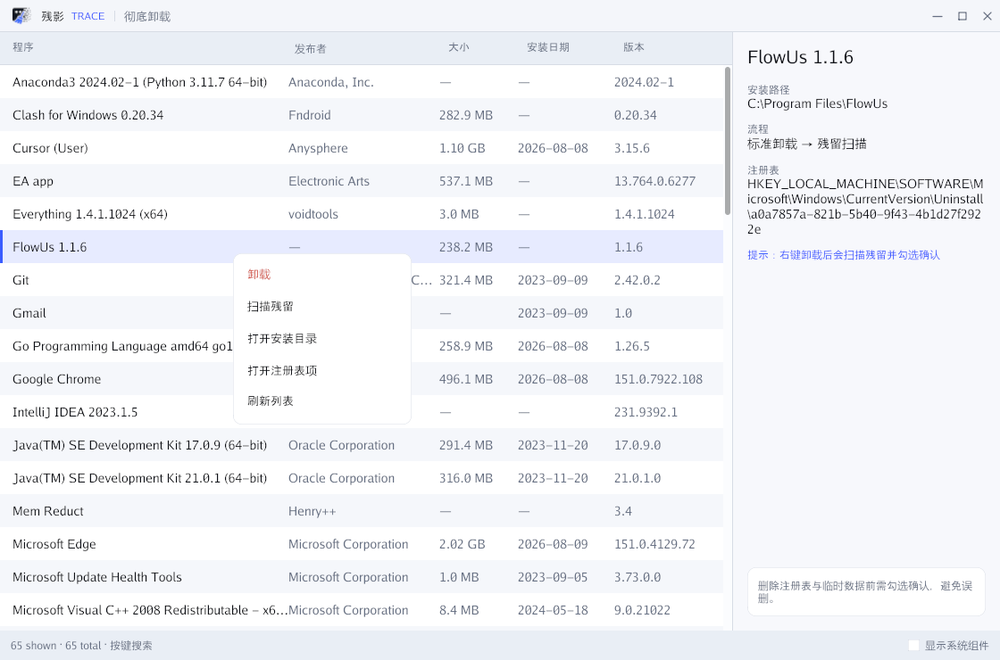

# 残影 TRACE

轻量、便携的 Windows 彻底卸载工具。

调用软件官方卸载器完成卸载，再扫描并清理高确定性残留（安装目录、同名文件夹/快捷方式、卸载项注册表），尽量少误删。

- **单文件**：约 9MB，绿色免安装
- **零运行时**：不依赖 .NET / Python 等
- **原生 GUI**：Go + [Gio](https://gioui.org/)

> 仍在积极开发中。欢迎 Issue / PR。

## 界面预览



## 功能

- 枚举已安装程序（注册表）
- 键盘搜索、刷新、系统组件显示开关
- 右键：卸载 / 扫描残留 / 打开目录 / 打开注册表
- 卸载完成后自动扫描残留，勾选确认后再删除
- 仅列出高确定性残留，避免模糊匹配误伤

## 下载

请到 GitHub **[Releases](../../releases)** 下载最新 `Trace.exe`，双击即可使用。

也可以自行编译（见下方）。

## 使用

1. 运行 `Trace.exe`
2. 选中程序，**右键**选择「卸载」或「扫描残留」
3. 若出现残留列表，勾选要删除的项后确认

提示：卸载过程会启动软件自带的卸载程序；取消卸载时不会进入残留删除。

## 从源码构建

环境：Windows + [Go](https://go.dev/dl/) 1.22+

```powershell
cd windows
$env:CGO_ENABLED = "0"
go build -trimpath -ldflags="-H windowsgui -s -w" -o publish\Trace.exe .
```

本地快速运行：

```powershell
cd windows
.\run.cmd
```

应用图标资源在 `windows/winres/` 与 `windows/assets/`。若修改了图标，需安装 [go-winres](https://github.com/tc-hib/go-winres) 后重新生成 `.syso`（`run.cmd` 在检测到工具时会自动执行）。

## 目录结构

```
trace/
├── README.md
├── images/            # 界面效果图（README 展示）
│   └── preview.png
└── windows/           # Windows 客户端（正式发行）
    ├── main.go        # 界面与交互
    ├── catalog/       # 枚举 / 卸载启动 / 残留扫描与清理
    ├── run.cmd
    └── publish/       # 本地构建输出（不入库，发版时上传 exe）
```

| 路径 | 是否提交到 Git | 说明 |
|------|----------------|------|
| `images/` | 是 | README 效果图 |
| `windows/catalog/` | 是 | 源代码 |
| `windows/publish/` | 否 | 编译产物，发版时作为 Release 附件 |
| `windows/bin/` | 否 | 本地缓存 |

## 发版建议

1. 打 tag，例如 `v0.1.0`
2. 按上文编译出 `Trace.exe`
3. 在 GitHub Release 中上传该文件，并写清本版更新点

## 注意事项

- 仅支持 **Windows**
- 残留清理会删除文件/注册表，请先确认勾选项
- 部分软件需管理员权限才能完整卸载
- 本工具不替代杀毒或系统还原；重要数据请先备份

## 贡献

欢迎通过 Issue 反馈问题，或提交 Pull Request：

- Bug：尽量附上软件名称、卸载命令（注册表 `UninstallString`）与复现步骤
- 功能：先开 Issue 讨论再动手，便于对齐方向

## 许可证

计划以开源许可证发布（例如 MIT）。正式选定后会在仓库根目录添加 `LICENSE` 文件。
